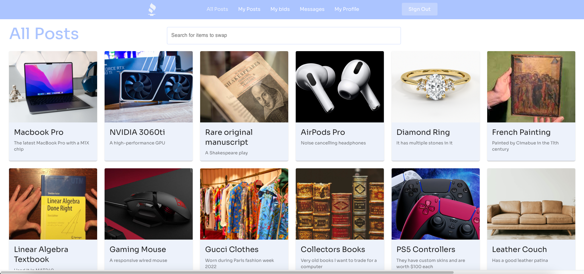

# Tradeverse

## About
This web app was created with the purpose of allowing users to to trade items with each other, rather than outright selling items for money. Users can post about an item they want to trade away, and other users can make bids on that item.
</br>

## Technologies Used
  - MongoDB
  - Express.js
  - React.js
  - Node.js
  - Google Cloud Platform (Google Maps API)
  - Cloudinary SDK

## Local Setup
Using these running instructions is ideal for viewing our webpages with posts, messages, etc.
```
git clone https://github.com/seyon99/Tradeverse.git
cd Tradeverse
git checkout dev
npm run setup
npm run startall
```
## Local Setup with Local MongoDB instance
Replace the connection string in server.js with mongodb://0.0.0.0:27017/Tradeverse
```
git clone https://github.com/seyon99/Tradeverse.git
cd Tradeverse
npm run setup
mkdir mongo-data
mongod --dbpath mongo-data
npm run startall
```
The app should start locally on port 3001. Open http://localhost:3001 to view it.
